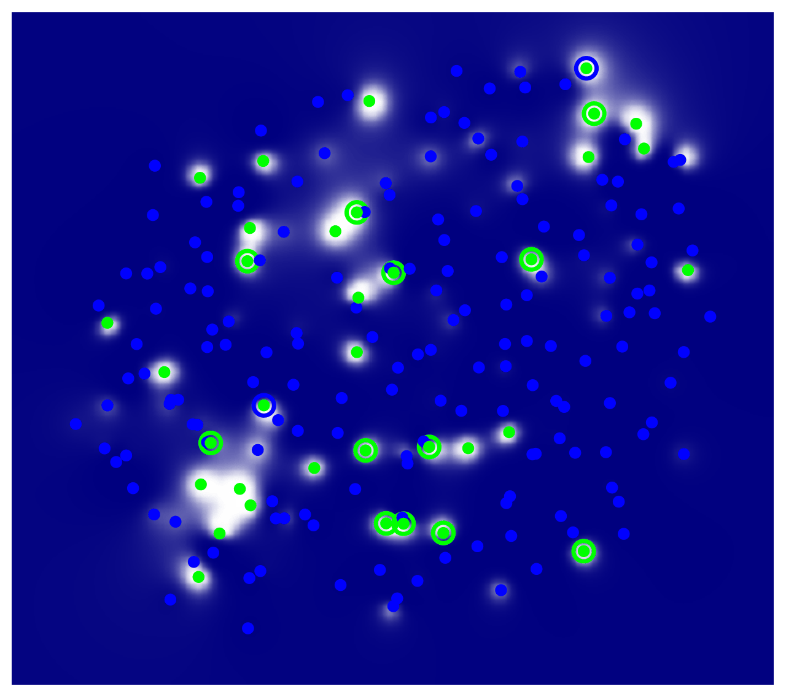
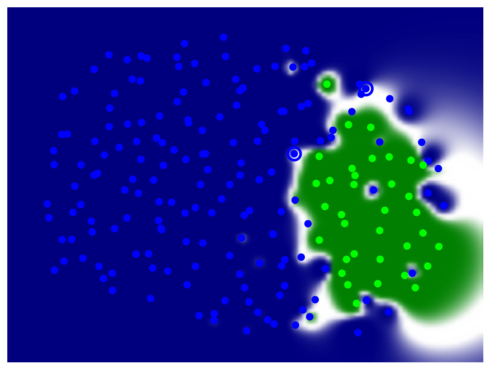
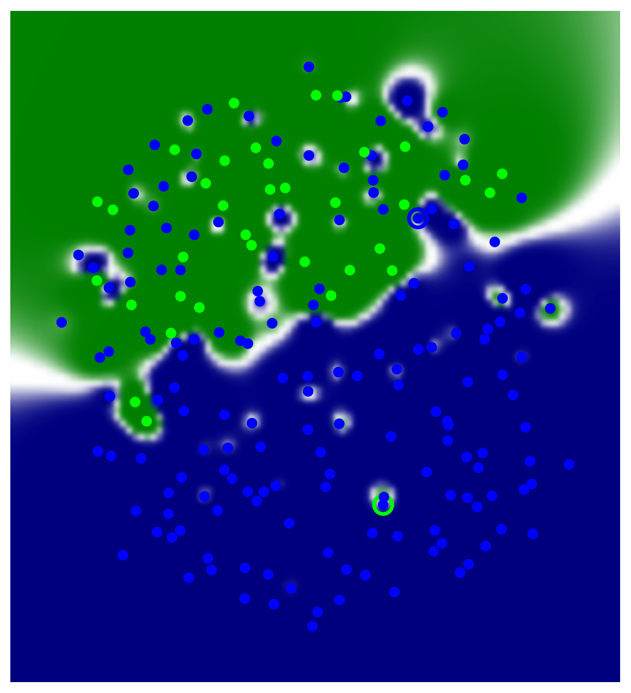
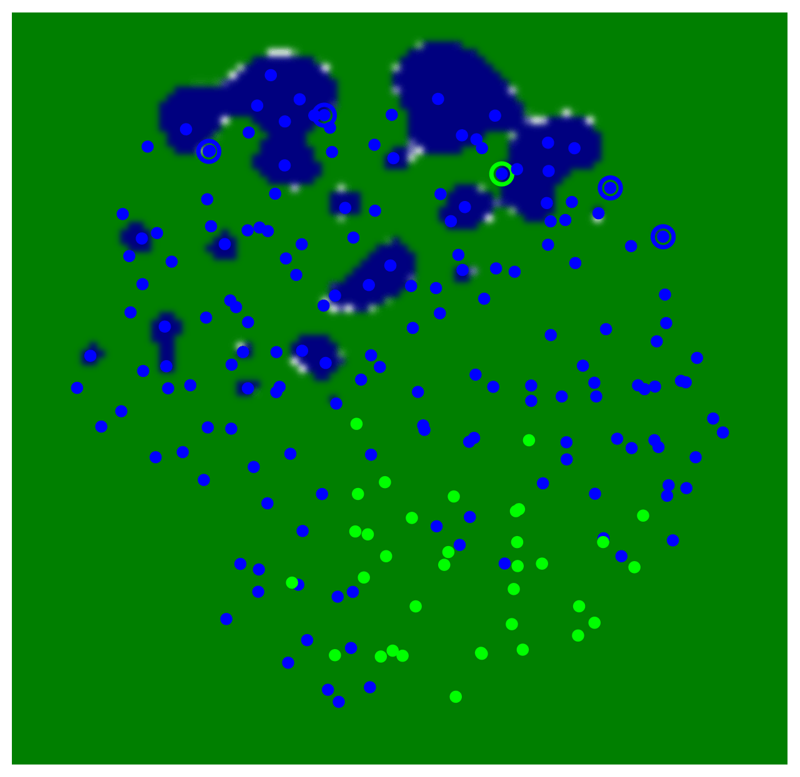

# A Possible Human-Centered Embedding Space Search in Degenerate Clifford Algebras

This repository accompanies our paper on visualizing and understanding embedding spaces generated by **DeCaL** (Degenerate Clifford Algebra Learning) using **DeepView**. We demonstrate how varying the Clifford algebra parameters `p`, `q`, and `r` produces fundamentally different embedding geometries, which can be explored and interpreted through human-centered visualization techniques.

---

## Overview

Knowledge Graph Embedding (KGE) models learn vector representations of entities and relations. **DeCaL** is a KGE model that operates in degenerate Clifford algebras $\mathcal{Cl}_{p,q,r}$, where:

- **p**: Number of basis vectors that square to +1 (positive signature)
- **q**: Number of basis vectors that square to -1 (negative signature)  
- **r**: Number of basis vectors that square to 0 (degenerate/null signature)

Different combinations of $(p, q, r)$ induce different algebraic structures and, consequently, different embedding space geometries. We use **DeepView** to visualize these high-dimensional embeddings in 2D, enabling human-centered exploration of the learned representations.

---

## DeepView Visualizations

We provide DeepView visualizations for four representative DeCaL configurations on the Family benchmark dataset. Each visualization reveals how entities cluster based on the underlying Clifford algebra structure.

### DeCaL with $(p=0, q=0, r=0)$


*Embedding space with trivial Clifford structure. This baseline configuration produces embeddings without geometric products from non-trivial basis elements.*

### DeCaL with $(p=0, q=0, r=1)$


*Embedding space with one degenerate basis vector ($e^2 = 0$). The null element introduces dual-number-like arithmetic, affecting how relations compose.*

### DeCaL with $(p=0, q=1, r=0)$


*Embedding space with one negative-signature basis vector ($e^2 = -1$). This configuration introduces complex-number-like structure into the embeddings.*

### DeCaL with $(p=1, q=0, r=0)$


*Embedding space with one positive-signature basis vector ($e^2 = +1$). This split-complex structure enables hyperbolic-like transformations.*

---

## Installation

```shell
# Create a virtual Python environment with conda 
conda create -n venv python=3.10.14 --no-default-packages && conda activate venv && pip install -e . && cd Ontolearn

# Unzip the benchmark datasets' knowledge graphs
unzip KGs.zip

# Unzip the learning problems
unzip LPs.zip
```

Additional datasets and learning problems can be downloaded from [here](https://drive.google.com/file/d/1LWmrtVQFh2_9eWOUsGZTGVeTkxi3n5pk/view?usp=sharing).

---

## Reproducing the Experiments

### Training DeCaL with Different $(p, q, r)$ Configurations

Run all 8 combinations of binary Clifford parameters:

```bash
for p in 0 1; do
  for q in 0 1; do
    for r in 0 1; do
      python examples/concept_learning_evaluation_reasoners.py --p $p --q $q --r $r
    done
  done
done
```

Or run a specific configuration:

```bash
python examples/concept_learning_evaluation_reasoners.py --reasoner EBR --p 1 --q 0 --r 0
```

### Command-Line Arguments

| Argument                | Description                                                     |
| ----------------------- | --------------------------------------------------------------- |
| `--p`, `--q`, `--r`     | Clifford algebra signature parameters for DeCaL                 |
| `--max_runtime`         | Max runtime per learning problem (default: `10` seconds)        |
| `--lps`                 | Path to learning problems (`lps.json`)                          |
| `--kb`                  | Path to the OWL knowledge base                                  |
| `--reasoner`            | Reasoner: `EBR`, `Pellet`, `HermiT`, `JFact`, `Openllet`, `Structural` |
| `--operation`           | Type: `normal`, `incomplete`, or `inconsistent`                 |
| `--gamma`               | Threshold parameter for EBR reasoner (default: `0.5`)           |

### Fixed DeCaL Hyperparameters

| Parameter         | Value | Description                              |
|-------------------|-------|------------------------------------------|
| `embedding_dim`   | 32    | Dimension of entity/relation embeddings  |
| `num_epochs`      | 100   | Training epochs                          |
| `learning_rate`   | 0.1   | Learning rate                            |
| `batch_size`      | 1024  | Batch size                               |

---

## Understanding the Clifford Algebra Parameters

The signature $(p, q, r)$ defines the Clifford algebra $\mathcal{Cl}_{p,q,r}$ with $n = p + q + r$ basis vectors:

| Configuration | Algebra | Geometric Interpretation |
|--------------|---------|--------------------------|
| $(0,0,0)$    | $\mathbb{R}$ | Real numbers (baseline) |
| $(1,0,0)$    | $\mathbb{R} \oplus \mathbb{R}$ | Split-complex numbers |
| $(0,1,0)$    | $\mathbb{C}$ | Complex numbers |
| $(0,0,1)$    | $\mathbb{R}[\epsilon]/(\epsilon^2)$ | Dual numbers |
| $(1,1,0)$    | $\mathbb{R}(2)$ | 2×2 real matrices |
| $(1,0,1)$    | Mixed split-complex + dual | Hybrid geometry |
| $(0,1,1)$    | Mixed complex + dual | Hybrid geometry |
| $(1,1,1)$    | Full degenerate algebra | Richest structure |

---

## Concept Learning with EBR Reasoner

The **EBR** (Embedding-Based Reasoner) uses DeCaL embeddings to perform approximate reasoning for class expression learning.

### Example: Family Dataset

```shell
python examples/concept_learning_evaluation_reasoners.py \
  --reasoner EBR \
  --operation normal \
  --kb "KGs/Family/family-benchmark_rich_background.owl" \
  --lps "LPs/Family/lps.json" \
  --p 1 --q 0 --r 0
```

### Threshold Effect

The `--gamma` parameter controls the similarity threshold for the EBR reasoner:

```shell
# Higher threshold = stricter matching
python examples/concept_learning_evaluation_reasoners.py --gamma 0.9 --p 1 --q 1 --r 1
```

---

## Deriving Experiments from Visualizations

The experiments in this repository were derived from insights gained through the **DECAL_visualizations.ipynb** notebook. This notebook uses DeepView to create interactive 2D visualizations of the high-dimensional DeCaL embeddings, enabling human-centered exploration of how different Clifford algebra configurations affect entity clustering and class membership prediction.

The visualizations revealed that:
- Different $(p, q, r)$ configurations produce distinct embedding geometries
- Class boundaries vary significantly across configurations
- Some configurations yield better class separability for certain family relationships

These observations motivated two systematic experiments to quantify the generalization and robustness properties of DeCaL embeddings.

To explore the visualizations yourself:

```bash
jupyter notebook DECAL_visualizations.ipynb
```

---

## Experiment 1: Class-Level Generalization

This experiment evaluates how well DeCaL embeddings generalize when class membership information is progressively removed from the knowledge base.

### Running the Experiment

```bash
python generalization_exp.py
```

### What It Does

1. **Systematic Class Removal**: For each class of interest (Brother, Mother, Father, etc.), the experiment removes 0%, 5%, 10%, ..., 80% of the `rdf:type` assertions
2. **Model Training**: Trains DeCaL embeddings on the degraded knowledge base for each $(p, q, r)$ configuration
3. **Evaluation**: Measures how well the model can still predict class membership for:
   - All individuals (overall performance)
   - Removed individuals only (generalization to unseen data)

### Output

Results are saved to `experiment_results/generalization_exp/` as CSV files (one per run).

### Analyzing Results

Open the analysis notebook to visualize performance metrics:

```bash
jupyter notebook gen_exp_results.ipynb
```

The notebook:
- Loads and aggregates results across multiple runs
- Computes mean and standard deviation for recall, precision, accuracy, and Jaccard scores
- Generates plots showing performance vs. removal rate for each $(p, q, r)$ configuration

---

## Experiment 2: Random Incompleteness with KNN

This experiment evaluates embedding robustness under random triple removal using multi-label KNN classification.

### Running the Experiment

```bash
python random_incompleteness_KNN.py
```

### What It Does

1. **Random Statement Removal**: Removes a percentage of arbitrary triples (not class-specific) from the knowledge base
2. **Embedding Generation**: Trains DeCaL on the incomplete knowledge base
3. **Multi-label KNN**: Uses MLkNN to predict class memberships based on embedding similarity
4. **Evaluation**: Computes Hamming loss and zero-one loss on:
   - All data (overall performance)
   - Affected individuals only (robustness to missing information)

### Output

Results are saved to `experiment_results/random_incompleteness_exp/knn_random_incompleteness_results.csv`.

### Analyzing Results

Open the analysis notebook to explore KNN performance:

```bash
jupyter notebook random_knn_exp_results.ipynb
```

The notebook:
- Loads the KNN experiment results
- Aggregates metrics by neighborhood size and removal rate
- Analyzes how embedding locality (via KNN) helps recover missing class memberships

---

## Experiment Results

Results are organized by $(p, q, r)$ configuration in the `Experiments_p_q_r/` directories:

```
Experiments_0_0_0/family_gamma_0_5.csv
Experiments_0_0_1/family_gamma_0_5.csv
Experiments_0_1_0/family_gamma_0_5.csv
Experiments_0_1_1/family_gamma_0_5.csv
Experiments_1_0_0/family_gamma_0_5.csv
Experiments_1_0_1/family_gamma_0_5.csv
Experiments_1_1_0/family_gamma_0_5.csv
Experiments_1_1_1/family_gamma_0_5.csv
```

### Sample Results: Family Dataset with $(p=0, q=0, r=0)$

| Learning Problem | F1-OCEL | F1-CELOE | F1-Evo | F1-CLIP |
|------------------|---------|----------|--------|---------|
| Grandson | 0.811 | 0.977 | 0.977 | 0.977 |
| Mother | 1.000 | 1.000 | 1.000 | 1.000 |
| Brother | 0.923 | 0.923 | 0.952 | 0.923 |
| Father | 1.000 | 1.000 | 1.000 | 1.000 |
| Grandgrandfather | 0.694 | 0.944 | 0.944 | 0.944 |

---

## Project Structure

```
├── DECAL_visualizations.ipynb       # DeepView visualization notebook (experiment derivation)
├── generalization_exp.py            # Experiment 1: Class-level generalization
├── gen_exp_results.ipynb            # Analysis notebook for Experiment 1
├── random_incompleteness_KNN.py     # Experiment 2: Random incompleteness with KNN
├── random_knn_exp_results.ipynb     # Analysis notebook for Experiment 2
├── experiment_helpers.py            # Helper functions for experiments
├── images/                          # DeepView visualizations
│   ├── deepview_0_0_0.pdf          # Visualization for (p=0,q=0,r=0)
│   ├── deepview_0_0_1.pdf          # Visualization for (p=0,q=0,r=1)
│   ├── deepview_0_1_0.pdf          # Visualization for (p=0,q=1,r=0)
│   └── deepview_1_0_0.pdf          # Visualization for (p=1,q=0,r=0)
├── experiment_results/              # Output from experiments
│   ├── generalization_exp/         # Experiment 1 results (CSV files)
│   └── random_incompleteness_exp/  # Experiment 2 results (CSV files)
├── Experiments_p_q_r/               # Concept learning results for each configuration
├── examples/                        # Example scripts
├── ontolearn/                       # Core library
└── KGs/                             # Knowledge graphs
```

---

## Citation

If you use this work, please cite:

```bibtex
@article{decal_deepview2026,
  title={A Possible Human-Centered Embedding Space Search in Degenerate Clifford Algebras},
  author={...},
  year={2026}
}
```

---

## License

See [LICENSE](LICENSE) for details


